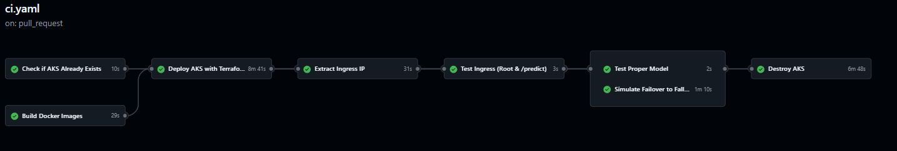
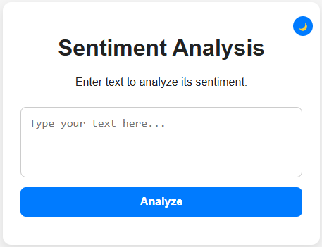
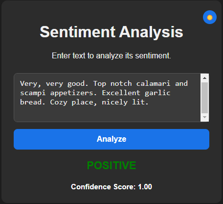
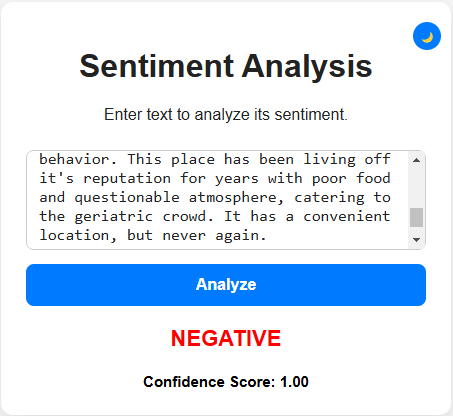

# Sentiment Analysis on AKS
---

This is a simple sentiment analysis application that provides a two-model (**Proper** & **Fallback**) system deployed on **Azure Kubernetes Service (AKS)** with a web-based UI. In a high level, it features:
- A `Proper Model`, that is a pre-trained model that provides sentiment analysis on the input text.
- A `Fallback Model`, that is a simple failover model that provides sentiment analysis on the input text when the `Proper Model` service is down or not functional.
- A `Web UI` served by Nginx, that is a simple web-based UI that allows users to input text and get the sentiment analysis result.
- `Ingress Controller`, that is used to route the incoming traffic to the appropriate service.

The project includes Terraform, GitHub Actions, Docker, Kubernetes, and a few other tools to automate the deployment process.

## Table of Contents
- [Overview](#overview)
- [Architecture](#architecture)
- [Prerequisites](#prerequisites)
- [Project Structure](#project-structure)
- [How It Works](#how-it-works)
- [Local Development and Testing](#local-development)
- [CI/CD Pipeline](#cicd-pipeline)
- [Usage](#usage--testing)
- [Destroying the Cluster](#destroying-the-cluster)

## <a name="overview"></a>Overview
We deploy a sentiment analysis application with two separate models:

1. **Proper Model**: A more advanced pre-trained model (**DistilBERT**) that provides sentiment analysis on the input text. **CoLa (Corpus of Linguistic Acceptability)** is also used to filter out buzzwords and irrelevant text. The model is served using **FastAPI**.
2. **Fallback Model**: A simple program that provides sentiment analysis on the input text and serves as a failover service when the Proper Model is unavailable.


A Web-UI (with Vanilla JS) is also deployed to input text and see the result.

Everything runs on AKS with an Ingress resource so you can publicly access the app (when deployed).

## <a name="architecture"></a>Architecture

The high-level architecture of the project is as follows:


## <a name="prerequisites"></a>Prerequisites
1. **Azure Subscription** with permissions to create AKS and its components (e.g., Azure Load Balancer, Public IP, VM Scale Set, etc.)
2. **Azure CLI** to interact with Terraform and Azure resources if needed.
3. **Terraform** to deploy AKS and every kubernetes component that is required (Deployments, Services, Ingress and so on).
4. **Docker** to build and push the Docker images to a container repository.
5. **Python** if you plan to run model APIs directly.
6. **(Optional)** **kubectl** to interact with the AKS cluster.


## <a name="project-structure"></a>Project Structure
The project is structured as follows:

```bash
.
├── proper_model/
│   ├── app.py                                  # Proper Model API (FastAPI)
│   └── Dockerfile
├── fallback_model/
│   ├── app.py                                  # Fallback Model API
│   ├── tests/
│   └── Dockerfile
├── web-ui/                                     # Web UI components
│   ├── index.html, script.js, Dockerfile  
├── k8s/                                        # Kubernetes manifests
│   ├── proper-deployment.yaml
│   ├── fallback-deployment.yaml
│   ├── web-ui-deployment.yaml
│   ├── ingress.yaml
│   └── ...
|── juju/
├───├── main.tf, variables.tf, outputs.tf       # Experimental Juju TF config
│   ├── ...  
├── aks/
│   ├── azure.tf, kubernetes.tf, ...            # Terraform config
│   ├── variables.tf, outputs.tf
│   ├── ...
├── .github/workflows/ci.yaml                   # GitHub Actions pipeline
└── README.md                                   # This readme :)
```


## <a name="how-it-works"></a>How It Works

- **GitHub Actions** fully automates the CI/CD pipeline.
    1. Builds the Docker images and pushes them to Docker Hub.
    2. Deploys the AKS cluster.
    3. Deploys all the necessary Kubernetes components on the AKS cluster.
    4. Tests the ingress, endpoints and the failover mechanism.
    5. Destroys the AKS cluster after the tests are successfully done.

- **Two Docker images** are built for the sentiment models.
    - `axoy/sentiment-analysis-proper-model:cors-middleware`
    - `axoy/sentiment-analysis-fallback-model:cors-middleware`

- **One Docker image** for the Web UI:
    - `axoy/sentiment-web-ui:nginx`

- **Terraform** is used to deploy the AKS cluster and all the required components. It is skipped in the CI if the cluster already exists (deployed locally). Kubernetes provider is also used to deploy everything related to Kubernetes.


## <a name="local-development"></a> Local Development and Testing
You can run the models and the web UI locally for local development purposes.

### 1. Using Local Machine

Make sure you have Python installed on your machine. You can install the required packages using `pip install -r requirements.txt` in relevant folders:

```bash
# Proper Model
cd proper_model
python3 -m venv proper_venv
source proper_venv/bin/activate
pip install -r requirements.txt
uvicorn app:app --host 0.0.0.0 --port 8000 --reload

# Fallback Model
cd fallback_model
python3 -m venv fallback_venv
source fallback_venv/bin/activate
pip install -r requirements.txt
uvicorn app:app --host 0.0.0.0 --port 8001 --reload
```

The Web UI can be served using any static server. For example, you can use Python's built-in HTTP server:

```bash
cd web-ui
python -m http.server 8080
```

### 2. Using Docker

You can also run the models and the web UI using Docker:

```bash
# Proper Model
cd proper_model
docker build -t sentiment-analysis-proper-model .
docker run -d -p 8000:8000 sentiment-analysis-proper-model

# Fallback Model
cd fallback_model
docker build -t sentiment-analysis-fallback-model .
docker run -d -p 8001:8001 sentiment-analysis-fallback-model

# Web UI
cd web-ui
docker build -t sentiment-web-ui .
docker run -d -p 8080:80 sentiment-web-ui
```

Or simply pull and run the images from Dockerhub:
```bash
docker run -d -p 8000:8000 axoy/sentiment-analysis-proper-model:cors-middleware
docker run -d -p 8001:8001 axoysentiment-analysis-fallback-model:cors-middleware
docker run -d -p 8080:80 axoy/sentiment-web-ui:nginx
```

After running the models and the web UI, you can access the Web UI at `http://localhost:8080` and test the sentiment analysis. 

The models are also accessible without the Web UI, for this you can use `curl` or any other HTTP client:

```bash
$ curl -X 'POST' \
  'http://localhost:8000/sentiment' \
  -H 'accept: application/json' \
  -H 'Content-Type: application/json' \
  -d '{
  "text": "I love this product!"
}'

{"label":"POSITIVE","score":1.0}

$  curl -X 'POST' \
  'http://localhost:8000/predict' \
  -H 'accept: application/json' \
  -H 'Content-Type: application/json' \
  -d '{
  "text": "I shouldnt have wasted my time and money on this, a horrible movie!"
}'

{"label":"NEGATIVE","score":1.0}
```

## <a name="cicd-pipeline"></a>CI/CD Pipeline

The CI/CD pipeline is fully automated using GitHub Actions. The pipeline is triggered on almost(depending on the changed file types) every push and pull request to the `main` branch.

The pipeline consists of the following steps:



1. Check if AKS exists
2. Build & Push Docker images (Proper, Fallback, Web-UI) to DockerHub
3. Deploy AKS with Terraform, if AKS doesn't exist
4. Extract Ingress IP 
5. Test Ingress (Root & /predict endpoints)
6. Test Proper Model
6. Simulate Failover (scale down Proper) & test again
7. Destroy AKS to avoid any costs, only if it was created in the pipeline

## <a name="usage--testing"></a>Usage & Testing


After obtaining the Ingress IP, you can access the Web UI at `http://<ingress-ip>` and test the inference.

 



## <a name="destroying-the-cluster"></a>Destroying the Cluster

If the AKS cluster is created by the pipeline, it is automatically destroyed after the CI is run. If you created the cluster using Terraform locally, then simply apply
```bash
terraform destroy -auto-approve
```

If the cluster is created using any other way, like the Azure Portal, and you want to destroy the cluster manually, you can run the following command:

```bash
az aks delete --name <cluster-name> --resource-group <resource-group-name> --yes

# Make sure you are logged in to Azure in CLI, if not apply first:
az login
```